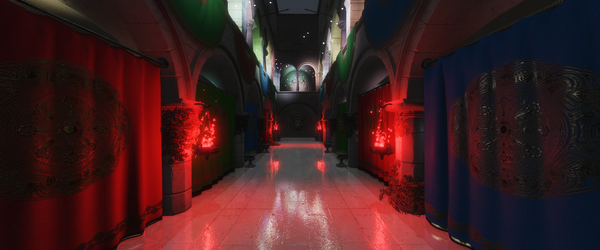
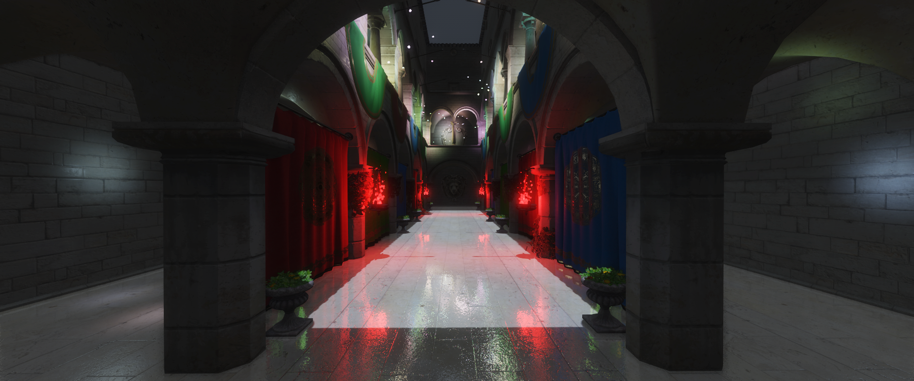

# WebGPU Sponza Demo

WebGPU tech demo showcasing various rendering techniques.

## About

A WebGPU deferred rendering playground written as a personal project to familiarize myself better with the API and explore various rendering techniques. As WebGPU is still considered experimental browser technology certain things might break for you.

Check out the accompanying frame analysis article [here](https://georgi-nikolov.com/blog/webgpu-sponza-frame-analysis).

## Features

1. glTF loading and parsing
2. Physically based shading
3. Cascaded shadow mapping (2 cascades)
4. Deferred Renderer (3 MRT) with culled light volumes using a stencil buffer
5. 400+ dynamic light sources moved in a compute shader
6. Separate forward pass for alpha masked objects (foliage)
7. SSAO
8. Screen Space Reflections with the ability to switch between Hi-Z and Linear raymarching
9. Physically based bloom
10. Temporal Anti-Aliasing (TAA)
11. UI controls to tweak various different rendering parameters
12. Dynamic performance degradation if the framerate dips below 60fps for longer than 2 seconds
13. Mobile support

## Requirements

WebGPU is still considered experimental technology and might not be implemented in the version of your browser of choice. Please refer to the [WebGPU Implementation Status](https://github.com/gpuweb/gpuweb/wiki/Implementation-Status) for more info.

## Dependencies

1. [@loaders.gl/gltf](https://www.npmjs.com/package/@loaders.gl/gltf) - Loading and parsing the glTF Sponza file
2. [webgpu-utils](https://www.npmjs.com/package/webgpu-utils) - Random useful things for WebGPU
3. [wgpu-matrix](https://github.com/greggman/wgpu-matrix) - Fast 3d math library for webgpu
4. [wgsl-preprocessor](https://github.com/toji/wgsl-preprocessor) - Adds simple preprocessor macros to your WGSL shader
5. [hdr.js](https://www.npmjs.com/package/hdr.js) - RGBE(.hdr) file reader/writer

## References and Readings

1. [WebGPU Shadow Playground](https://github.com/toji/webgpu-shadow-playground)
2. [WebGPU Clustered Forward Shading](https://github.com/toji/webgpu-clustered-shading/tree/main)
3. [SSAO](https://alextardif.com/SSAO.html)
4. [Screen Space Reflections: Implementation and optimization – HI-Z Tracing Method](https://sugulee.wordpress.com/2021/01/19/screen-space-reflections-implementation-and-optimization-part-2-hi-z-tracing-method/)
5. [Temporal Anti-Aliasing(TAA) Tutorial](https://sugulee.wordpress.com/2021/06/21/temporal-anti-aliasingtaa-tutorial/)
6. [Physically Based Bloom](https://learnopengl.com/Guest-Articles/2022/Phys.-Based-Bloom)
7. [Cascaded Shadow Mapping](https://learnopengl.com/Guest-Articles/2021/CSM)
8. [Satin - A 3D Graphics Framework built on Apple's Metal](https://github.com/Hi-Rez/Satin)
9. [WebGPU Spec](https://www.w3.org/TR/webgpu/)
10. [WGSL Spec](https://www.w3.org/TR/WGSL/)

## Running Locally

1. Clone the repo locally
2. `npm i`
3. `npm run dev`

## License

MIT License
Copyright (c) 2024 Georgi Nikolov

Permission is hereby granted, free of charge, to any person obtaining a copy of this software and associated documentation files (the "Software"), to deal in the Software without restriction, including without limitation the rights to use, copy, modify, merge, publish, distribute, sublicense, and/or sell copies of the Software, and to permit persons to whom the Software is furnished to do so, subject to the following conditions:

The above copyright notice and this permission notice shall be included in all copies or substantial portions of the Software.

THE SOFTWARE IS PROVIDED "AS IS", WITHOUT WARRANTY OF ANY KIND, EXPRESS OR IMPLIED, INCLUDING BUT NOT LIMITED TO THE WARRANTIES OF MERCHANTABILITY, FITNESS FOR A PARTICULAR PURPOSE AND NONINFRINGEMENT. IN NO EVENT SHALL THE AUTHORS OR COPYRIGHT HOLDERS BE LIABLE FOR ANY CLAIM, DAMAGES OR OTHER LIABILITY, WHETHER IN AN ACTION OF CONTRACT, TORT OR OTHERWISE, ARISING FROM, OUT OF OR IN CONNECTION WITH THE SOFTWARE OR THE USE OR OTHER DEALINGS IN THE SOFTWARE.
